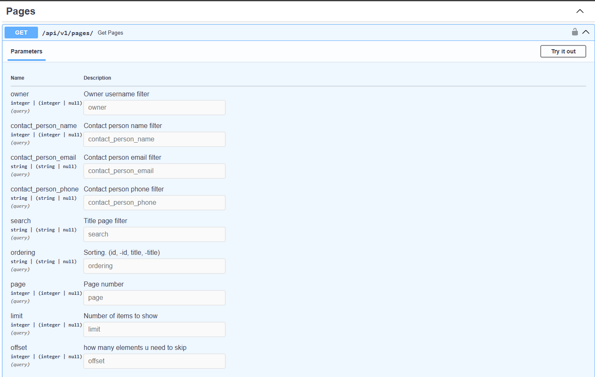
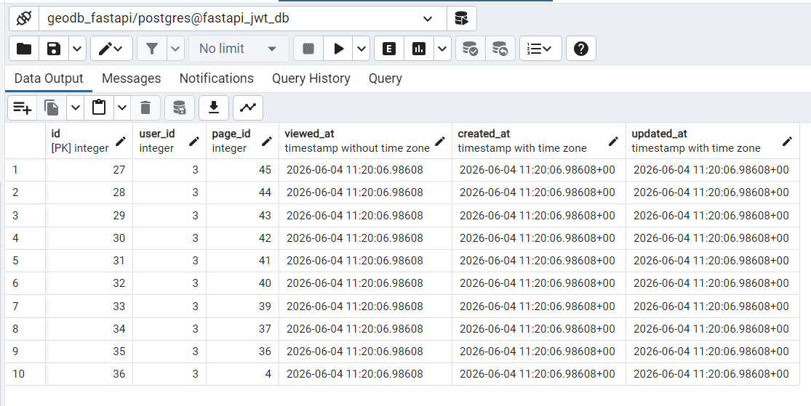

# FastAPI Pages & History Service

This service is an asynchronous FastAPI application designed to work alongside the main Django backend. It serves as a proxy for managing, filtering, and sorting pages while tracking user activity entirely in the background.

## 🚀 Key Features

* **Django API Proxying:** Fetches the main page list directly from the Django backend.
* **Advanced Query Handling:** Seamlessly passes pagination (`limit`), text search (`search`), sorting (`ordering`), and custom relational filters (like `owner` or `contact_person`) over to Django.
* **Asynchronous User Tracking:** Uses FastAPI's native `BackgroundTasks` to log every viewed page into a local PostgreSQL database without slowing down the client's HTTP response.

---

## 🛠️ Architecture & Data Flow

1. The client sends a request to the FastAPI endpoint (e.g., `/api/v1/pages/?limit=10`).
2. FastAPI forwards the query parameters to Django using an asynchronous HTTP client (`httpx`).
3. Django processes the filters, increments its internal view statistics, and returns a paginated list of pages.
4. FastAPI immediately sends this list back to the client.
5. In the background, FastAPI extracts the `id` of every page returned in that batch and saves a view log entry into the local PostgreSQL history table.



---

## ⚙️ Setup & Deployment

### 1. Prerequisites (Shared Docker Network)
Both the FastAPI and Django applications communicate via a shared Docker network. Before booting up the containers, you **must** create this external network manually if it doesn't already exist:

```bash
docker network create my_shared_network
```

### 2. Spinning Up the Containers
Both services utilize Docker Compose profiles. To build and launch the database, Redis cache, and the FastAPI application in the background, run the following command in both project directories (Django and FastAPI):

```bash
docker compose --profile full up -d --build
```

---

## 📊 Database Tracking (FastAPI Side)

While Django keeps track of global page statistics, the FastAPI service manages a dedicated, isolated PostgreSQL database to monitor detailed user-specific history.

Whenever a user requests a list of pages, the application logs an entry for every single page included in that batch. For example, if a page size (`limit`) is 10, a single click will record 10 distinct historical rows tied to that user session.

### The History Table Schema:
* `id` (`Integer`, PK): Unique log identifier.
* `user_id` (`Integer`): The ID of the user who viewed the pages (passed via custom headers).
* `page_id` (`Integer`): The ID of the specific page that was rendered.
* `viewed_at` / `created_at` (`Timestamp`): High-precision timestamps capturing the exact microsecond the batch commit occurred.



---

## 🛠️ Local Verification

To ensure everything is wired correctly:
1. Open the interactive docs at `http://localhost:8001/docs`.
2. Execute the pages endpoint with your filters.
3. Connect your database GUI (like **pgAdmin**) to `localhost:5434` (mapped from the internal `5432` port).